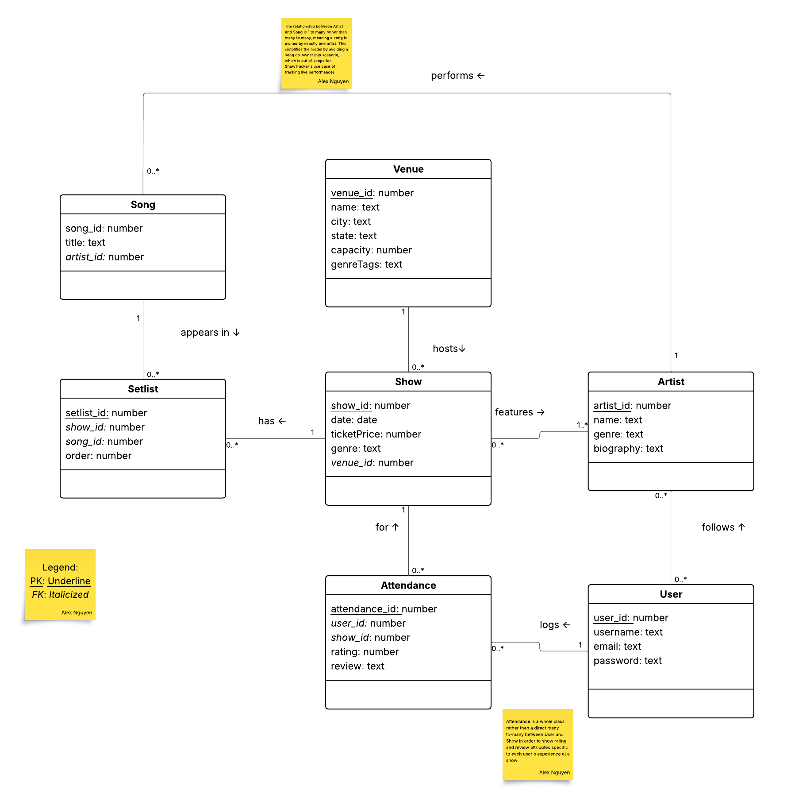

# ShowTracker Database

A complete database design and implementation for **ShowTracker**, a platform that lets users track live music show attendance, rate performances, follow artists, and browse setlists across venues.

---

## Quick Start

```bash
# 1. Create and populate the database
sqlite3 showtracker.db < sql/create_tables.sql
sqlite3 showtracker.db < sql/populate_data.sql

# 2. Run any query
sqlite3 -header -column showtracker.db < sql/queries/query1.sql
```

---

## Repository Structure

```
show-tracker/
├── README.md                     ← This file
├── showtracker.db                ← SQLite3 database file
│
├── documents/
│   ├── requirements.pdf          ← [Point 1] Requirements document
│   └── query_outputs.txt         ← [Point 7] Example outputs of all queries
│
├── diagrams/
│   ├── ERD and Relational Schema.pdf  ← [Points 3 & 4] ERD + Relational schema with BCNF proof
│   └── uml_conceptual_model.png       ← [Point 2] UML Conceptual Model
│
└── sql/
    ├── create_tables.sql         ← [Point 5] DDL statements
    ├── populate_data.sql         ← [Point 6] Test data
    └── queries/
        ├── query1.sql            ← [Point 7] Join of 4 tables
        ├── query2.sql            ← [Point 7] Subquery
        ├── query3.sql            ← [Point 7] GROUP BY + HAVING
        ├── query4.sql            ← [Point 7] Complex search criterion
        └── query5.sql            ← [Point 7] RANK() OVER with PARTITION BY + CASE/WHEN
```

---

## Assignment Deliverables

### Point 1 — Requirements Document (10 pts)

**File:** [`documents/requirements.pdf`](documents/requirements.pdf)

Describes the ShowTracker problem domain, lists business rules for tracking live music attendance, and extracts candidate nouns (entities/attributes) and actions (relationships) from those rules.

### Point 2 — UML Conceptual Model (15 pts)

**File:** [`diagrams/uml_conceptual_model.png`](diagrams/uml_conceptual_model.png)



Five entity classes with full multiplicity constraints and typed attributes:

- **1:N** — Venue hosts Shows
- **1:N** — Artist writes Songs
- **M:N** — Show features Artists (via ShowArtist)
- **M:N** — User attends Shows (via Attendance, carrying `rating` and `review`)
- **M:N** — User follows Artists (via UserFollows)
- **M:N** — Show includes Songs in Setlist (via Setlist, carrying `order_num`)

### Point 3 — Logical Data Model / ERD (10 pts)

**File:** [`diagrams/ERD and Relational Schema.pdf`](diagrams/ERD%20and%20Relational%20Schema.pdf)

All M:N relationships resolved into association entities:

- **ShowArtist** resolves Show ↔ Artist
- **UserFollows** resolves User ↔ Artist
- **Attendance** resolves User ↔ Show (carries `rating` and `review` attributes)
- **Setlist** resolves Show ↔ Song (carries `order_num`)

### Point 4 — Relational Schema in BCNF (15 pts)

**File:** [`diagrams/ERD and Relational Schema.pdf`](diagrams/ERD%20and%20Relational%20Schema.pdf)

Nine relations, each proven to be in BCNF by listing functional dependencies and verifying every determinant is a superkey:

| # | Relation | Key | Non-trivial FDs | BCNF? |
|---|----------|-----|-----------------|-------|
| 1 | User | {user_id}, {username}, {email} | user_id → username, email, password; username → all; email → all | ✓ |
| 2 | Artist | {artist_id} | artist_id → name, genre, biography | ✓ |
| 3 | Venue | {venue_id} | venue_id → name, city, state, capacity, genreTags | ✓ |
| 4 | Show | {show_id} | show_id → date, ticketPrice, genre, venue_id | ✓ |
| 5 | Song | {song_id} | song_id → title, artist_id | ✓ |
| 6 | Attendance | {attendance_id} | attendance_id → user_id, show_id, rating, review | ✓ |
| 7 | Setlist | {setlist_id} | setlist_id → show_id, song_id, order_num | ✓ |
| 8 | ShowArtist | {show_id, artist_id} | All-key (no non-trivial FDs) | ✓ |
| 9 | UserFollows | {user_id, artist_id} | All-key (no non-trivial FDs) | ✓ |

### Point 5 — SQL DDL (10 pts)

**File:** [`sql/create_tables.sql`](sql/create_tables.sql)

Creates all 9 tables with:

- Primary keys (`AUTOINCREMENT` where appropriate)
- Foreign keys referencing parent tables
- CHECK constraints (e.g., `capacity > 0`, `ticketPrice >= 0`, `rating BETWEEN 1 AND 5`)
- UNIQUE constraints (`User.username`, `User.email`)
- Composite primary keys for junction tables (`ShowArtist`, `UserFollows`)

### Point 6 — Test Data (10 pts)

**File:** [`sql/populate_data.sql`](sql/populate_data.sql)

| Table | Records | Notes |
|-------|---------|-------|
| Venue | 5 | Real music venues across the US |
| Artist | 8 | Real artists spanning Indie, Folk, Hip-Hop, R&B |
| User | 8 | Fictional users with unique usernames |
| Show | 10 | Spanning March 2024 – March 2025 |
| Song | 20 | Real songs by each artist |
| ShowArtist | 12 | Multi-artist show assignments |
| UserFollows | 18 | Users following various artists |
| Attendance | 15 | With ratings (1–5) and detailed reviews |
| Setlist | 20 | Ordered song lists for shows |

### Point 7 — Queries (10 pts)

All queries and their outputs are documented in [`documents/query_outputs.txt`](documents/query_outputs.txt).

| Query | Requirement | File | Description |
|-------|-------------|------|-------------|
| 1 | Join of ≥3 tables | [`query1.sql`](sql/queries/query1.sql) | Each attendance record with username, show date, venue name, rating, and review (joins Attendance → User → Show → Venue) |
| 2 | Subquery | [`query2.sql`](sql/queries/query2.sql) | Find all users who have attended at least one show (subquery on Attendance in WHERE clause) |
| 3 | GROUP BY + HAVING | [`query3.sql`](sql/queries/query3.sql) | Artists with an average attendance rating above 4 (joins Attendance → Show → ShowArtist → Artist) |
| 4 | Complex search criterion | [`query4.sql`](sql/queries/query4.sql) | Shows that are Indie Folk or Folk Rock, cost less than $70, and have at least one attendance record (OR + AND + IN with subquery) |
| 5 | Advanced mechanisms | [`query5.sql`](sql/queries/query5.sql) | RANK() OVER with PARTITION BY user and CASE/WHEN to label ratings as Excellent/Good/Average/Poor |

## How to Run Queries Individually

```bash
# Make sure database exists
sqlite3 showtracker.db < sql/create_tables.sql
sqlite3 showtracker.db < sql/populate_data.sql

# Run any query with formatted output
sqlite3 -header -column showtracker.db < sql/queries/query1.sql
sqlite3 -header -column showtracker.db < sql/queries/query2.sql
sqlite3 -header -column showtracker.db < sql/queries/query3.sql
sqlite3 -header -column showtracker.db < sql/queries/query4.sql
sqlite3 -header -column showtracker.db < sql/queries/query5.sql
```

## AI Usage

AI (Claude by Anthropic) was used throughout this project for the following:

- **Planning** — breaking down the project deliverables, splitting tasks between team members, and creating a work schedule
- **Requirements Document** — drafting business rules, classifying nouns and verbs, and refining the document structure
- **UML Class Diagram** — generating class attributes, types, relationships, and multiplicities as a reference for building the diagram in LucidChart
- **Test Data** — generating realistic INSERT statements for all 9 tables
- **Query Outputs** — formatting query results into a readable output file

All AI-generated content was reviewed, tested, and verified by the team before inclusion in the project.